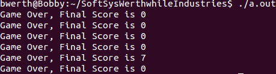

# Re-making Asteroids in C

## Bryan Werth and Kaitlyn Keil

### Shooting for the Stars... or at least, the asteroids

For Project 1, we are building a flash game that will involve shooting and destroying asteroids that fall from the top of the screen via a user-controlled space craft icon. As a lower bound, we will have a projectile, the asteroid, moving with a simple, randomly assigned velocity and trajectory on the screen along with a movable game token, the spaceship, that can shoot at the asteroid to destroy it. If the asteroid touches the spaceship, there is a notification of game over. Stretch goals are going to involve building out game functionality to include a variety of asteroids of varying sizes and more than one life for the player.

This project is meant to help us improve our C programming, both through learning new techniques (such as how to use OpenGL through Glut) and by refining old skills (like object oriented programming). The relatively simple concept has many places where it can be optimized, where making a poor decision could severely limit gameplay; collision detection for a large number of moving objects, for example. By making informed choices on how to handle such obstacles, we will improve ourselves as programmers and researchers.

### Re-sourcing Resourcecs

We were able to find a number of resources for Glut, which we chose to use based on previous Software System projects. These tutorials and pieces of advice have let us progress pretty well in the space of graphics, though we are, if anything, under-utilizing Glut. We've also been able to find resources for things such as quadtrees, which we are examining for collision detection.

### Done, But Only Getting Started

We were able to successfully build a version of asteroids with automatically generating asteroids, a spaceship that shoots projectiles, and collision detection between the asteroids and both the spaceship and projectiles. We used quadtrees to handle collision detection with the asteroids, checking for collisions between the asteroids and the center of the projectiles as well at four key points on the spaceship. The projectiles generate from the spacecraft when the user presses the insert key and are removed and erased when off the screen.

When there is a collision between the spaceship and an asteroid, the asteroid is destroyed and Game Over prints to terminal with the final number of asteroids destroyed by the user.

Given our original mvp as well as all of our stretch-goals, it is safe to say that our final product is somewhere between the two. Our minimum viable product was a movable spaceship that had to avoid asteroids, with some sort of endgame if asteroid collides with the spaceship. We had a number of stretch goals including integrating score, the ability for the spaceship to shoot projectiles, along with a variety of other desired improvements to the mechanisms and gameplay. We were able to integrate a version of scoring as well as the ability for the spaceship to shoot projectiles that can destroy asteroids, but there are lots of things we would want to do to improve the quality of gameplay overall. For example, if we were to continue with this project, we would want to have an in screen endgame animation that notifies of game over, displays score, and resets the game. We would also want better collision detection and better controls for the shooting and movement of the spaceship. Despite this, we acheived our learning goals quite effectively. Both of us are much more comfortable with C after this project. We are also much more comfortable with openGL, linkedlists, quadtrees, and structures. 

